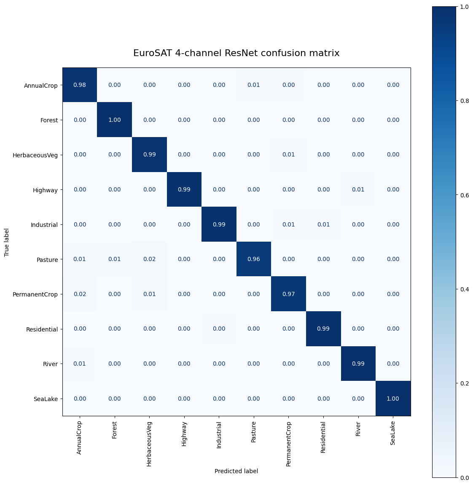
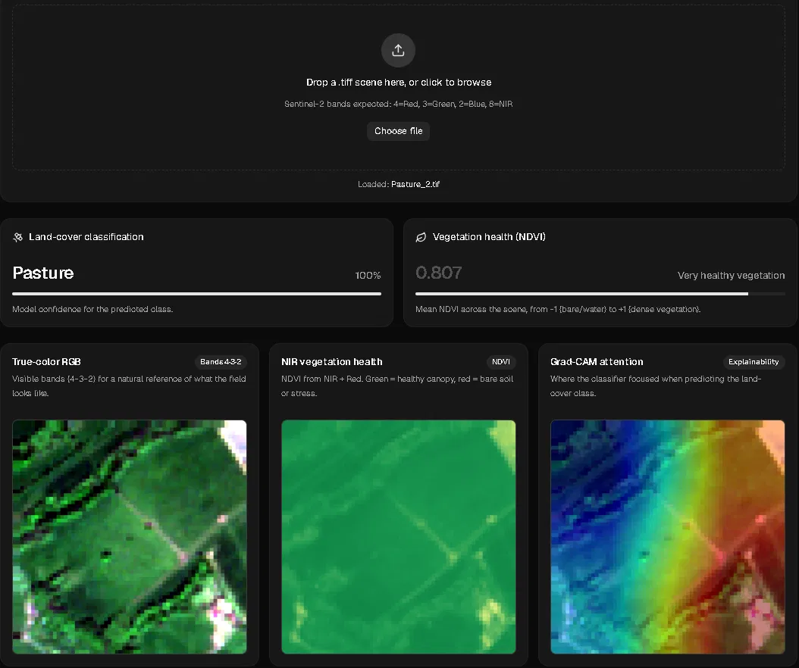
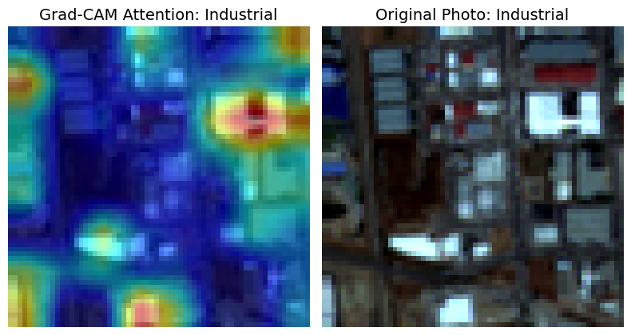

<div align="center">


#EuroSAT Multispectral Land-Cover Classifier

**A 4-channel (RGB + Near-Infrared) ResNet18 classifier for Sentinel-2 satellite imagery, served via a Dockerized FastAPI backend with a live explainability dashboard.**

[](https://www.python.org/)
[](https://pytorch.org/)
[](https://fastapi.tiangolo.com/)
[](https://www.docker.com/)

</div>

---

## Overview

A research-driven multispectral land-cover classifier built on the [EuroSAT](https://github.com/phelber/EuroSAT) dataset — 27,000 Sentinel-2 image patches across 10 land-use classes. A pretrained ResNet18 is modified to accept a **4th input channel (Near-Infrared)** alongside RGB, since vegetation health and land surface composition separate far more cleanly in NIR than in visible light alone. Served via a Dockerized FastAPI backend with a live classification + NDVI + Grad-CAM dashboard.

---

## Results

Evaluated on a held-out test set of **4,140 images**, never seen during training or hyperparameter selection.

| Metric | Value |
|---|---|
| **Test Accuracy** | **98.77%** |
| **95% Confidence Interval** | [98.43%, 99.10%] (±0.34% margin of error) |
| **Macro F1-score** | 0.99 |
| **Weighted F1-score** | 0.99 |

<details>
<summary><b>Full per-class classification report</b></summary>

| Class | Precision | Recall | F1-score | Support |
|---|---|---|---|---|
| AnnualCrop | 0.98 | 0.98 | 0.98 | 500 |
| Forest | 0.98 | 1.00 | 0.99 | 429 |
| HerbaceousVegetation | 0.98 | 0.99 | 0.98 | 468 |
| Highway | 1.00 | 0.99 | 0.99 | 379 |
| Industrial | 0.99 | 0.99 | 0.99 | 387 |
| Pasture | 0.99 | 0.96 | 0.97 | 285 |
| PermanentCrop | 0.97 | 0.97 | 0.97 | 383 |
| Residential | 1.00 | 0.99 | 0.99 | 445 |
| River | 0.99 | 0.99 | 0.99 | 343 |
| SeaLake | 1.00 | 1.00 | 1.00 | 521 |

</details>

<div align="center">

</div>

Row-normalized so each cell reflects *"of all true images of this class, what fraction were predicted as the column class."* The model holds ≥96% recall on every class, with the only mild confusion appearing between visually and spectrally similar vegetation-adjacent categories (Pasture ↔ AnnualCrop/HerbaceousVegetation) rather than the Forest/Pasture pairing originally hypothesized at the project's outset.

---

## Live Demo

<div align="center">

</div>

The dashboard accepts a raw Sentinel-2 `.tif` scene and returns, in real time:

| Panel | What it shows |
|---|---|
| **Land-cover classification** | Predicted class with model confidence |
| **Vegetation health (NDVI)** | Normalized Difference Vegetation Index computed from the NIR + Red bands, scored from -1 (bare/water) to +1 (dense canopy) |
| **True-color RGB** | Bands 4-3-2 rendered for human-readable visual reference |
| **NIR vegetation health map** | Per-pixel NDVI visualization |
| **Grad-CAM attention** | Where the classifier actually looked when making its prediction |

The app also accepts standard 8-bit JPG/PNG input via a documented heuristic NIR-approximation path — see [Known Limitations](#known-limitations) for exactly how that works and why it should be treated as lower-confidence than native multispectral input.

---

## Running This Project

### Option 1 — Docker (recommended)

```bash
git clone https://github.com/Tweezky66/EuroSAT-Multispectral-Classification.git
cd EuroSAT-Multispectral-Classification
docker compose up --build
```

The API will be available at `http://127.0.0.1:8000`, with interactive Swagger docs at `http://127.0.0.1:8000/docs`.

### Option 2 — Local Python environment

```bash
git clone https://github.com/Tweezky66/EuroSAT-Multispectral-Classification.git
cd EuroSAT-Multispectral-Classification
pip install -r requirements.txt
uvicorn api.main:app --reload
```

### Making a prediction

```bash
curl -X 'POST' \
  'http://127.0.0.1:8000/predict/' \
  -H 'accept: application/json' \
  -H 'Content-Type: multipart/form-data' \
  -F 'file=@your_scene.tif;type=image/tiff'
```

Expected band order for native `.tif` input: **Band 4 = Red, Band 3 = Green, Band 2 = Blue, Band 8 = NIR** (Sentinel-2 convention).

---

## Who This Is For

Recruiters and engineers evaluating applied ML/CV competency; researchers interested in multispectral transfer learning on small remote-sensing datasets; anyone curious how far a single pretrained CNN backbone can be pushed beyond its original 3-channel design.

---

## Why Near-Infrared?

Sentinel-2 captures 13 spectral bands, far beyond the 3 (Red, Green, Blue) that consumer cameras and pretrained ImageNet backbones expect. Standard practice in transfer learning is to discard everything but RGB to fit existing pretrained weights. This project instead asks: **what is the cheapest, most defensible way to recover some of that discarded signal without abandoning transfer learning entirely?**

The answer implemented here is a single additional channel — Band 8 (NIR) — fused into a modified ResNet18 input layer. Healthy vegetation reflects roughly 40-50% of NIR light, while built surfaces and water reflect far less, making NIR a strong discriminator for exactly the land-cover classes (Forest, Pasture, vegetation-heavy crops) that are hardest to separate in visible light alone.

---

## Architecture & Engineering Decisions

| Decision | Rationale |
|---|---|
| **Backbone: pretrained ResNet18** | At 64×64 resolution and ~22K training images, a from-scratch CNN risks severe underfitting. ImageNet-pretrained low-level filters (edges, textures) transfer well even with a modified input layer. |
| **Conv1 modified for 4 channels** | The original 3-channel `(64, 3, 7, 7)` weight tensor is preserved for RGB; the 4th-channel slice is initialized via **channel-wise weight averaging** (mean of the 3 pretrained channels) rather than random noise — giving the new NIR filters a stable, edge-aware starting point instead of training from zero. |
| **Discriminative learning rates** | Early blocks (`layer1`, `layer2`) are frozen entirely. `layer3`/`layer4` train at `lr/10`. The modified `conv1` and the new 10-class `fc` head train at the full base learning rate — reflecting how "pretrained but adapted" each layer is. |
| **Per-channel normalization (not per-image)** | Computed once across the **training split only** (avoiding data leakage into validation/test) to preserve the physically meaningful magnitude differences between RGB and NIR reflectance — a global per-image normalization would have flattened exactly the signal the NIR channel was added to capture. |
| **Strict train/val/test separation** | Class-balance and normalization statistics are computed *after* splitting, never before — a deliberate guard against the most common silent failure mode in research-style ML pipelines. |

---

## Known Limitations

This section exists because a results table without documented failure modes is not a complete research artifact.

**1. Grad-CAM reveals a likely framing bias, not just a vegetation signal.**

<div align="center">

</div>

When inspecting Grad-CAM attention for `Industrial`-class predictions, the model attends strongly not only to built structures but, in some samples, to open sky/cloud regions in the frame. The most likely explanation is **not** a NIR-channel failure but a **dataset composition confound**: industrial zones are frequently captured with more open sky in frame (flat, low-density land use) than classes like Residential or Forest. The model may be partially exploiting this compositional artifact rather than purely structural features. This is disclosed rather than hidden — the fix under consideration is sky-pixel masking during training or targeted attention regularization, not yet implemented.

**2. Synthetic-NIR path for standard JPG/PNG input is a documented heuristic, not a true reconstruction.**

The API and UI accept standard 8-bit photos for convenience, but a JPG fundamentally discards the spectral information a NIR channel encodes — no post-hoc scaling can recover it. For non-`.tif` input, the API approximates the missing NIR channel using the training-set NIR mean and linearly rescales RGB channels toward the Sentinel-2 reflectance range. The API response includes an explicit `input_type` field (`"native_multispectral"` vs `"synthetic_nir"`) so any consumer of this API knows exactly which trust level applies to a given prediction. **Predictions on standard photos should be treated as lower-confidence than predictions on native `.tif` Sentinel-2 input.**

**3. Evaluated on a single, geographically constrained benchmark.**

EuroSAT covers a defined set of European locations. No claims are made here about generalization to other continents, sensors, or seasons without further validation.

---

## Project Structure

```
EuroSAT-Multispectral-Classification/
├── EuroSAT-UI/                     # Next.js UI dashboard
│   ├── app/                        # React components and layout pages
│   ├── public/                     # Static frontend assets
│   ├── Dockerfile                  # Frontend container configuration
│   ├── package.json                # Node dependencies
│   └── ...                         # Next.js & Tailwind configs
├── notebook/                       # Research and experimentation
│   └── ...                         # API testing and model prototyping notebooks
├── docs/                           # Documentation assets
│   └── release_logo.gif            # Animated UI demonstration
├── app.py                          # FastAPI inference service
├── model.py                        # EuroSATResNet — 4-channel ResNet18 architecture
├── dataset.py                      # PyTorch dataset loading and transformations
├── data_audit.py                   # Dataset verification and preprocessing
├── train.py                        # Model training loop
├── evaluate.py                     # Model testing and metrics generation
├── resnet18_4channel_v1.pth        # Pretrained PyTorch model weights
├── docker-compose.yml              # Multi-container orchestration (API + UI)
├── Dockerfile                      # Backend container configuration
├── requirements.txt                # Python backend dependencies
├── .dockerignore                   
├── .gitignore                      
└── README.md
```

---

## Tech Stack

`PyTorch` · `torchvision` · `rasterio` · `FastAPI` · `Docker` · `scikit-learn` · `Grad-CAM` · `NumPy` / `Pandas`

---

## Author

Built for free use everywhere and by everyone,target audience: Small-medium argicultural busisneses.
@Tweezky66

</div>
